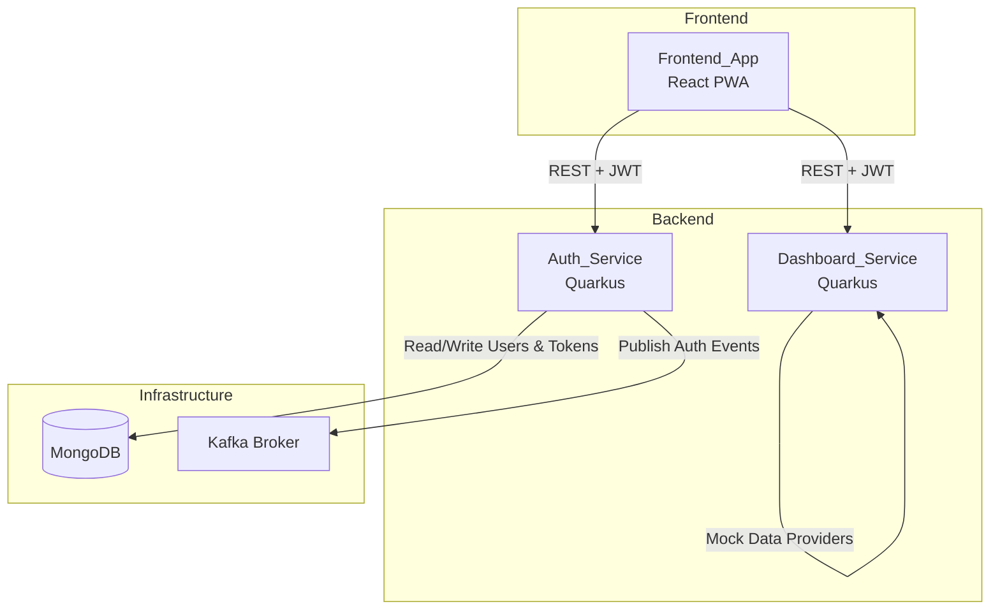
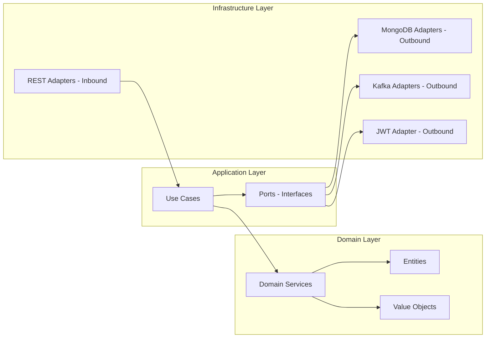

# Design Document

## Overview

ZenAndOps MVP is an ITSM platform that bridges ITIL best practices with SRE principles. The system consists of three main deployable units: an Auth_Service for authentication and authorization, a Dashboard_Service for aggregating operational metrics from mocked sources, and a Frontend_App (React PWA) for user interaction. All services follow hexagonal architecture with DDD, are containerized with Docker, and orchestrated via Docker Compose.

The MVP scope covers:
- JWT-based authentication with login, token refresh, and logoff
- RBAC and ABAC authorization via a Policy_Engine
- An operational dashboard displaying ITIL ticket metrics and SRE indicators (MTTR, MTTD, SLI/SLO compliance, error budget, change failure rate)
- Kafka event publishing for authentication events
- PWA capabilities for the frontend

### Key Technical Decisions

| Decision | Choice | Rationale |
|---|---|---|
| Backend language/runtime | Java 25, Quarkus | Modern Java with fast startup, native compilation support, and reactive capabilities |
| Build tool | Maven | Standard Java build tool with mature Quarkus plugin support |
| Architecture | Hexagonal + DDD | Decouples domain logic from infrastructure; enables adapter swapping |
| Database | MongoDB | Document-oriented storage fits flexible user/token schemas |
| Messaging | Kafka | Asynchronous event publishing for authentication events |
| Frontend framework | React 19 + TypeScript | Based on existing `.frontend-template` (TailAdmin) |
| Authentication | JWT (Access + Refresh tokens) | Stateless authentication with token rotation |
| Authorization | RBAC + ABAC | Fine-grained access control combining roles and attributes |
| Infrastructure | Docker + Docker Compose | Single-command startup for the entire stack |
| PWA | Service Worker + Web App Manifest | Installable app experience with offline login shell |

---

## Architecture

### High-Level Architecture



### Hexagonal Architecture (Per Service)



### Service Communication

- Frontend_App → Auth_Service: REST over HTTP with JWT Bearer tokens
- Frontend_App → Dashboard_Service: REST over HTTP with JWT Bearer tokens
- Auth_Service → MongoDB: Direct connection via Quarkus MongoDB client
- Auth_Service → Kafka: Reactive Messaging via SmallRye (Quarkus extension)
- Dashboard_Service: Internal mock data providers (no external dependencies in MVP)

---

## Components and Interfaces

### Auth_Service

#### Inbound Ports (REST API)

| Endpoint | Method | Description | Auth Required |
|---|---|---|---|
| `/api/v1/auth/login` | POST | Authenticate user, return Access_Token + Refresh_Token | No |
| `/api/v1/auth/refresh` | POST | Refresh tokens using a valid Refresh_Token | No (token in body) |
| `/api/v1/auth/logoff` | POST | Revoke Refresh_Token and terminate session | Yes (Bearer token) |

#### Outbound Ports (Interfaces)

| Port | Description |
|---|---|
| `UserRepository` | CRUD operations for User entities in MongoDB |
| `RefreshTokenRepository` | Store, find, and revoke Refresh_Tokens in MongoDB |
| `TokenProvider` | Generate and validate JWT Access_Tokens and Refresh_Tokens |
| `PasswordEncoder` | Hash and verify passwords using bcrypt |
| `AuthEventPublisher` | Publish authentication events (login, logoff, refresh) to Kafka |
| `PolicyEngine` | Evaluate RBAC and ABAC rules for authorization decisions |

#### Use Cases

| Use Case | Description |
|---|---|
| `LoginUseCase` | Validates credentials, issues tokens, publishes login event |
| `RefreshTokenUseCase` | Validates Refresh_Token, rotates tokens, publishes refresh event |
| `LogoffUseCase` | Revokes Refresh_Token, publishes logoff event |

### Dashboard_Service

#### Inbound Ports (REST API)

| Endpoint | Method | Description | Auth Required |
|---|---|---|---|
| `/api/v1/dashboard` | GET | Return the complete Dashboard_Payload | Yes (Bearer token) |

#### Outbound Ports (Interfaces)

| Port | Description |
|---|---|
| `TicketMetricsProvider` | Provides ticket counts grouped by ITIL lifecycle state |
| `SliSloMetricsProvider` | Provides SLI/SLO compliance percentages |
| `IncidentMetricsProvider` | Provides MTTR and MTTD values |
| `ChangeMetricsProvider` | Provides change failure rate and error budget consumption |

#### Use Cases

| Use Case | Description |
|---|---|
| `GetDashboardPayloadUseCase` | Aggregates data from all mock providers into a single Dashboard_Payload |

### Frontend_App

#### Pages

| Page | Route | Description |
|---|---|---|
| Login | `/login` | Authentication form derived from `.frontend-template` SignIn |
| Dashboard | `/` (protected) | Operational dashboard derived from `.frontend-template` Home |

#### Core Modules

| Module | Description |
|---|---|
| `AuthContext` | React context managing JWT tokens, login/logoff state, and auto-refresh |
| `ProtectedRoute` | Route guard that redirects unauthenticated users to login |
| `ApiClient` | Axios/fetch wrapper that attaches Bearer token and handles 401 retry |
| `DashboardPage` | Dashboard page with metric cards, charts, and gauges |
| `LoginPage` | Login form with validation, error display, and loading state |

---

## Data Models

### User (Auth_Service - MongoDB)

```json
{
  "_id": "ObjectId",
  "login": "string (unique)",
  "name": "string",
  "email": "string (unique)",
  "passwordHash": "string (bcrypt)",
  "roles": ["string"],
  "attributes": {
    "department": "string",
    "location": "string"
  },
  "active": "boolean",
  "createdAt": "ISODate",
  "updatedAt": "ISODate"
}
```

### RefreshToken (Auth_Service - MongoDB)

```json
{
  "_id": "ObjectId",
  "token": "string (unique, hashed)",
  "userId": "ObjectId",
  "expiresAt": "ISODate",
  "revoked": "boolean",
  "createdAt": "ISODate"
}
```

### Access_Token JWT Claims

```json
{
  "sub": "user-login",
  "userId": "ObjectId",
  "name": "string",
  "email": "string",
  "roles": ["ADMIN", "OPERATOR"],
  "attributes": {
    "department": "IT",
    "location": "HQ"
  },
  "iat": 1234567890,
  "exp": 1234568790
}
```

### Kafka Auth Event

```json
{
  "eventId": "UUID",
  "eventType": "LOGIN | LOGOFF | TOKEN_REFRESH",
  "userId": "string",
  "userLogin": "string",
  "timestamp": "ISODate",
  "metadata": {}
}
```

### Dashboard_Payload (Dashboard_Service Response)

```json
{
  "executiveSummary": {
    "totalOpenTickets": 142,
    "criticalIncidents": 3,
    "overallAvailability": 99.92,
    "errorBudgetRemaining": 68.5
  },
  "ticketsByState": {
    "new": 28,
    "processingAssigned": 35,
    "processingPlanned": 22,
    "pending": 18,
    "solved": 31,
    "closed": 8
  },
  "sliSloCompliance": {
    "availabilitySli": 99.92,
    "availabilitySlo": 99.9,
    "latencySli": 96.5,
    "latencySlo": 95.0
  },
  "incidentMetrics": {
    "mttrMinutes": 47.3,
    "mttrTrend": "DOWN",
    "mttdMinutes": 8.2,
    "mttdTrend": "STABLE"
  },
  "errorBudget": {
    "remainingPercentage": 68.5,
    "burnRate": 1.2,
    "windowDays": 30
  },
  "changeManagement": {
    "changeFailureRatePercentage": 4.8,
    "totalChanges": 62,
    "failedChanges": 3
  },
  "errors": []
}
```

### RBAC/ABAC Policy Model

```java
// RBAC: Role → Resource → Action mapping
public record RbacPolicy(
    Set<String> requiredRoles,
    String resource,
    String action
)

// ABAC: Attribute conditions for access
public record AbacPolicy(
    String resource,
    String action,
    Map<String, String> requiredUserAttributes,
    Map<String, String> requiredResourceAttributes,
    Map<String, String> environmentConditions
)
```

---

## Error Handling

### Auth_Service Error Responses

| Scenario | HTTP Status | Error Code | Description |
|---|---|---|---|
| Invalid credentials | 401 | `AUTH_INVALID_CREDENTIALS` | Login or password is incorrect (generic message) |
| Expired Access_Token | 401 | `AUTH_TOKEN_EXPIRED` | Access_Token has expired |
| Expired Refresh_Token | 401 | `AUTH_REFRESH_EXPIRED` | Refresh_Token has expired |
| Revoked Refresh_Token | 401 | `AUTH_REFRESH_REVOKED` | Refresh_Token has been revoked |
| Missing/invalid token | 401 | `AUTH_UNAUTHORIZED` | No valid token provided |
| Insufficient permissions | 403 | `AUTH_FORBIDDEN` | User lacks required role or attributes |
| Kafka unavailable | N/A (logged) | `EVENT_PUBLISH_FAILED` | Event publishing failure; request continues |

### Dashboard_Service Error Responses

| Scenario | HTTP Status | Error Code | Description |
|---|---|---|---|
| Unauthorized | 401 | `DASH_UNAUTHORIZED` | Missing or invalid Access_Token |
| Partial data failure | 200 | N/A | Partial payload with `errors` array populated |

### Frontend Error Handling

| Scenario | Behavior |
|---|---|
| Login failure | Display generic error message on login form |
| 401 on API call | Attempt token refresh → retry request → redirect to login on failure |
| Network error | Display connection error notification |
| Empty form submission | Inline validation messages for required fields |

### Error Response Format (Backend)

```json
{
  "error": {
    "code": "AUTH_INVALID_CREDENTIALS",
    "message": "Authentication failed",
    "timestamp": "2026-01-15T10:30:00Z"
  }
}
```

---

## Testing Strategy

Property-based testing is not applicable to this feature. The MVP consists primarily of infrastructure wiring (Docker, Kafka), UI rendering (React dashboard), authentication flows (JWT issuance/validation), and mocked data aggregation. These are best validated through example-based unit tests, integration tests, and manual verification.

However, per the user's explicit requirement, no test implementation is included in this MVP scope. Testing will be addressed in a future iteration.

Similarly, observability (metrics, logs, traces) is excluded from this MVP scope per the user's explicit requirement.

### Recommended Future Testing Approach

| Layer | Strategy |
|---|---|
| Auth_Service domain logic | Unit tests for use cases (login, refresh, logoff) |
| Policy_Engine | Unit tests for RBAC/ABAC rule evaluation |
| Dashboard_Service aggregation | Unit tests for payload assembly and partial failure handling |
| REST endpoints | Integration tests with Quarkus test framework |
| Frontend components | Component tests with React Testing Library |
| End-to-end flows | E2E tests with Playwright or Cypress |
| Docker Compose stack | Smoke tests verifying all services start and respond |
